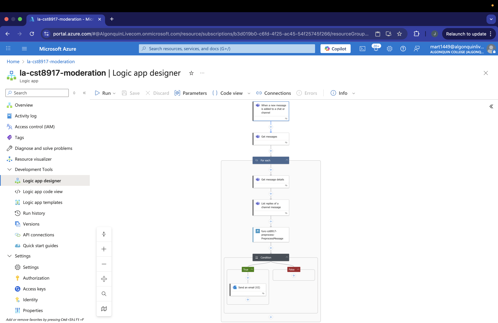
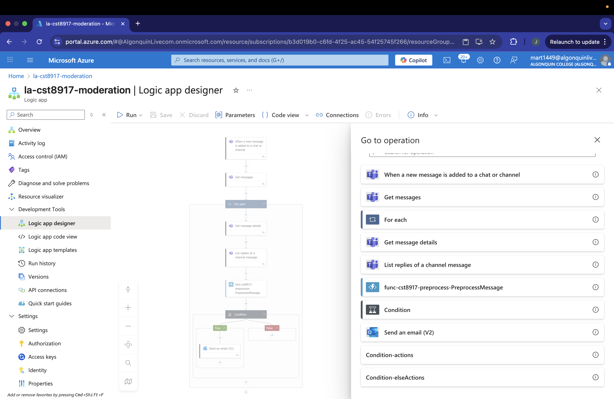

# CST8917 Lab 3: Teams Chat Content Moderation Service

## Overview  
We built an Azure Logic Apps–based moderation service that watches a Teams channel for new messages and flags inappropriate content by sending email alerts. A Python Azure Function preprocesses each message—stripping HTML and normalizing case—before the Logic App checks against a list of forbidden terms.

---

## Logic App Setup  
1. **Trigger**:  
   - **When a new message is added in a channel** (Microsoft Teams)  
   - Subscribes to the target channel via webhook.  
2. **List Channel Messages**  
   - Retrieves the full set of messages in the channel.  
3. **Filter Array**  
   - Keeps only top-level posts (`messageType == 'message'`).  
4. **For Each** post:  
   - **Get Message** (Teams connector) → fetches `body.content`.  
   - **HTTP** → calls Azure Function `/api/PreprocessMessage` with JSON:  
     ```json
     {
       "message":   "@{item()?['body']['content']}",
       "teamId":    "@{item()?['channelIdentity']['teamId']}",
       "channelId": "@{item()?['channelIdentity']['channelId']}",
       "user":      "@{coalesce(item()?['from']?['user']?['displayName'], 'Unknown')}",
       "messageId": "@{item()?['id']}"
     }
     ```
   - **Condition**:  
     ```expression
     @or(
       contains(body('PreprocessMessage')?['message'], 'shit'),
       contains(body('PreprocessMessage')?['message'], 'fuck'),
       contains(body('PreprocessMessage')?['message'], 'bitch')
     )
     ```
   - **If true** → **Send an email (V2)** with details:
     ```html
      A message in @{item()?['channelIdentity']['channelId']} contained forbidden content.
      User: @{body('PreprocessMessage')?['user']}
      Message ID: @{body('PreprocessMessage')?['messageId']}
      Content: @{body('PreprocessMessage')?['message']}
      Time: @{item()?['createdDateTime']}
     ```
   - **If false** → **Terminate** (Succeeded).

---

## Architecture Diagram




---

## How We Tested the Workflow  
1. Posted various messages in the target Teams channel:  
   - Clean messages (e.g. “Hello everyone”) → no email.  
   - Profanity messages (e.g. “This is shit”) → email received.  
2. Verified in Logic App **Runs history**:  
   - Trigger fired only on new posts.  
   - Azure Function returned normalized text.  
   - Condition branch correctly identified forbidden words.  
   - Email action executed under **If true**.

---

## Challenges & Resolutions  
- **Looping over all messages every run**  
  - **Issue**: The Logic App’s “List channel messages” returns the entire message history, so each new run re-loops through all past posts and re-sends emails for every forbidden term found, not just the newest message.  
  - **Resolution**: We accepted this limitation for the lab but recommend persisting the **last processed message ID** (e.g. in an Azure Storage table or Cosmos DB) and filtering `List channel messages` to only newer ones on subsequent runs.

---

## Recommendations for Future Improvement  
- **State tracking**: Store the latest processed timestamp or message ID to avoid reprocessing old messages.  
- **Delta queries**: Leverage Microsoft Graph’s delta API to fetch only new or changed messages.  
- **Caching**: Use a Redis cache or storage to maintain a sliding window of processed IDs.  
- **Scalability**: Batch processing or pagination for channels with high message volume.  
- **Enhanced moderation**: Integrate Azure Cognitive Services Content Moderator for richer profanity detection, PII masking, or sentiment analysis.

---

## Demo Video  
Watch my 5 minute walkthrough on YouTube:  
https://youtu.be/loOt2I9VGo8

---

> **Note**: Overall, the service works end-to-end—new messages are preprocessed, filtered for bad words, and trigger immediate email alerts. The only caveat is the current approach reprocesses all channel history each run; addressing that will make it production-ready.
